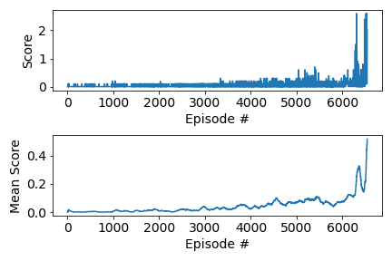

# Multi-Agent Deep Deterministic Policy Gradient (MADDPG) Report

## Learning Algorithm

The Multi-Agent Deep Deterministic Policy Gradient (MADDPG) algorithm was implemented to solve the Unity Tennis environment. MADDPG is an extension of DDPG for multi-agent environments. It allows each agent to have its own actor and critic networks, while critics can use information from all agents for centralized training. The main steps in each episode are:

1. Receive the initial states for all agents from the environment.
2. Each agent selects an action using its actor network, adding Ornstein-Uhlenbeck noise for exploration.
3. Execute the actions, observe the rewards and next states for all agents.
4. Store the experiences (states, actions, rewards, next_states, dones) for all agents in a shared replay buffer.
5. Every `LEARN_EVERY` steps, sample a minibatch from the buffer (if there are enough experience tuples) and perform multiple learning updates for each agent:
    - Update each agent's critic by minimizing the mean squared error between predicted Q-values and target Q-values, using all agents' actions and states.
    - Update each agent's actor using the sampled policy gradient.
    - Soft-update the target networks using the parameter $\tau$.

## Model Architecture

Each agent has its own actor and critic networks, which are fully connected feedforward neural networks:

- **Actor Network (per agent):**
    - Input Layer: Size equal to the state space (24 for Tennis).
    - Hidden Layer 1: 512 units, ReLU activation.
    - Hidden Layer 2: 512 units, ReLU activation.
    - Output Layer: Size equal to the action space (2 for Tennis), with tanh activation to bound actions in [-1, 1].

- **Critic Network (per agent):**
    - Input Layer: Concatenated states for all agents.
    - Hidden Layer 1: 512 units, ReLU activation.
    - Hidden Layer 2: The output of Hidden Layer 1 is concatenated with all agents' actions, and this combined input is passed through a fully connected layer with 512 units and ReLU activation.
    - Output Layer: 1 unit (Q-value).

## Hyperparameters

The following hyperparameters were used for training:

| Hyperparameter | Value         | Description                                  |
|---------------|---------------|----------------------------------------------|
| BUFFER_SIZE   | 1_000_000     | Replay buffer size                           |
| BATCH_SIZE    | 512           | Minibatch size for learning                  |
| GAMMA         | 0.99          | Discount factor for future rewards           |
| TAU           | 1e-3          | Soft update parameter for target networks    |
| LR_ACTOR      | 1e-4          | Learning rate for actor optimizer            |
| LR_CRITIC     | 1e-3          | Learning rate for critic optimizer           |
| HIDDEN_SIZE_1 | 512           | First hidden layer size                      |
| HIDDEN_SIZE_2 | 512           | Second hidden layer size                     |
| WEIGHT_DECAY  | 0.0001        | L2 weight decay for critic                   |
| LEARN_EVERY   | 2             | Steps between learning updates               |
| NUM_TRAINING  | 2             | Number of learning updates per step          |
| n_episodes    | 10_000        | Number of training episodes                  |
| t_max         | 1000          | Max timesteps per episode                    |
| θ (theta)     | 0.15          | OU noise parameter                           |
| σ (sigma)     | 0.2           | OU noise parameter                           |

An Ornstein-Uhlenbeck (OU) process was used as a noise model for exploration.

## Results

The following plot shows the episode scores and mean scores over time, where the episode score is the maximum score among both agents. Shortly after 6000 episodes, the agents start to learn quicker. The trained model parameters are saved in `checkpoint_actor_0.pth`, `checkpoint_critic_0.pth`, `checkpoint_actor_1.pth`, and `checkpoint_critic_1.pth`.

## Ideas for Future Work

Potential improvements include:
- Further tuning of hyperparameters for more stable multi-agent learning.
- Implementing alternative exploration strategies (e.g., parameter noise).
- Using prioritized experience replay.
- Experimenting with different network architectures.